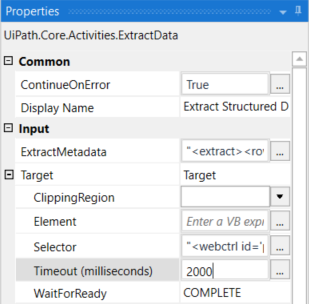

# Scrape Indeed
This project will use Robotic Process Automation (RPA) in the form of UiPath to scrape Job Postings from https://www.indeed.co.za.

This is a micro project that is the first of a series of micro projects that will be build, expanded and later on integrated into a complete end-to-end solution were postings are scraped, streamed to a Big Data platform, and then analysed.

## Logical Flow

## Sample Output

The image below shows a sample of a .json file that this robot produces. The intention is to use this output and perform some clean-up on it using [Apache Spark](https://spark.apache.org/) as part of the next step in the data pipeline.

## Lessons Learned

### Speed Up the ExtractData Activity
When it is waiting for the next button on the last item to find it, ContiniueOnError is set to true, so it will continue, but the default TimeOut is 30s, so decrease it to 2000 (2s) or so to drastically reduce the time you have to wait for that.

### Break up the Monolith
While it works to have the entire RPA workflow contained in a single .xaml file as in the initial version of this project, I do feel it has several disadvantage. The first two which stands out:
1. __Degugging is harder__ - When it is a single .xaml file you have to either run everything when debugging the workflow, or comment out pieces not to execute as I have done during the development.
2. __Multiple Engineers__ - It would be very inefficient for multiple engineers to work in parallel on different sub-functions of the workflow.

The solution should be quite obvious, the robot should be split into sub-functions (seperate .xaml files) just as in a traditional procedural programming language.
